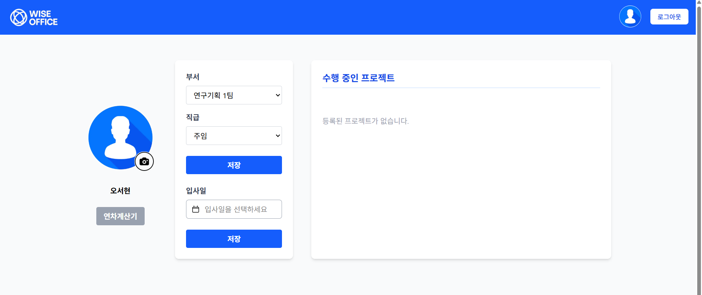
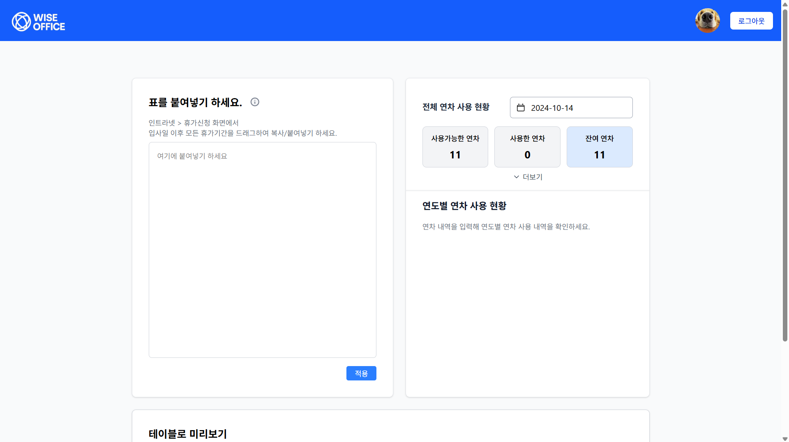
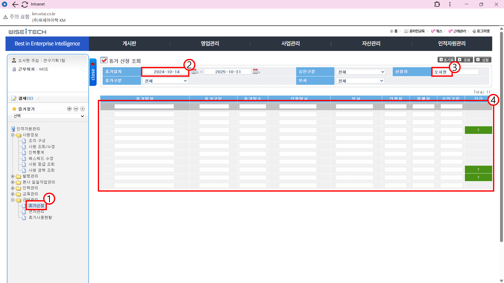
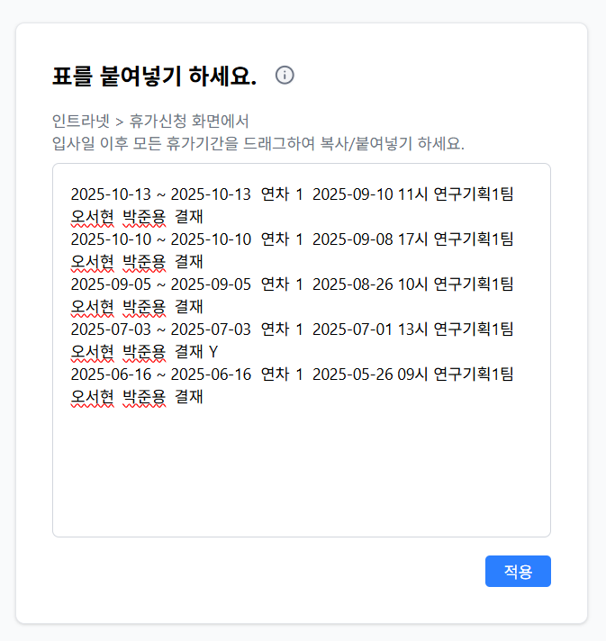
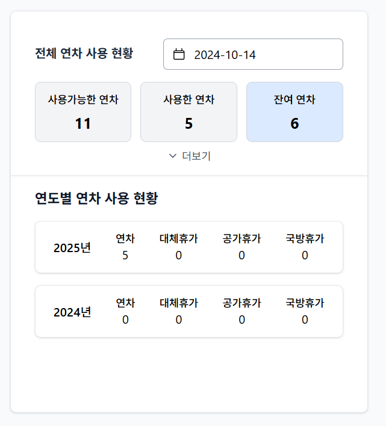

# 연차계산기 매뉴얼

|문서버전|작성일|작성자|
|:-:|:-:|:-:|
|v1.0|2025.10.01|오서현 주임|
|v1.1|2025.10.01|박중언 주임|

## 1. 입사일 등록

> 개인페이지에서 사전에 입사일 정보를 저장하여 사용할 수 있습니다.  
> 개인페이지에서 `연차계산기` 버튼을 눌러 연차계산기 페이지로 이동합니다.  

## 2. 휴가내역 복사하기

### 2-0. KM에 접속
  - [위세아이텍 KM](http://km.wise.co.kr/WiseIntranet)
### 2-1. 근태관리 > 휴가신청 탭
### 2-2. `휴가일자`의 시작일을 입사일자로 선택
### 2-3. `신청자`에 본인 이름 입력
### 2-4. 전체 휴가 내역을 복사
  - 첫번째 칸 선택 후 `shift` 누른 상태로 마지막 칸 선택
  - 반드시 정확하게 모든 내역 및 칸을 선택해야 합니다.

## 3. 연차계산기 좌측 입력란에 휴가내역 붙여넣기 후 적용 버튼 클릭

